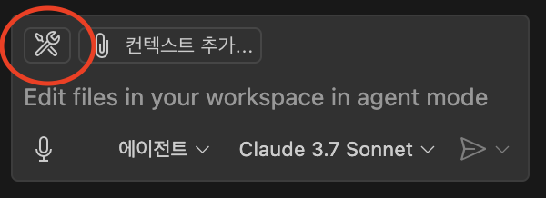
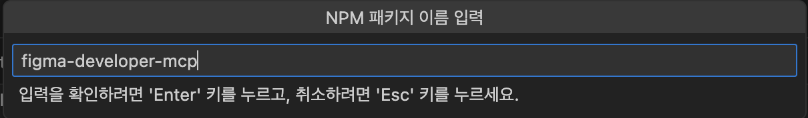
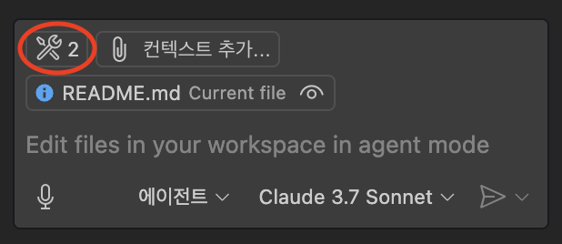

# 개발환경 세팅

1. Visual Studio Code의 최신 버전을 [설치](https://code.visualstudio.com/Download)합니다.

1. 설정에서 `Agent`를 검색하고 아래와 같이 적용합니다.
   

1. 화면 좌측의 `채팅` 아이콘을 눌러 Copilot 대화창을 엽니다. <br/>
   

1. 대화창 하단의 드롭다운 버튼을 눌러 `에이전트 모드`로 바꿉니다.
   

1. 대화창 하단의 드롭다운 버튼을 눌러 AI 모델을 `Claude 3.7 Sonnet`으로 바꿉니다.
   

1. 에이전트 모드를 사용할 준비가 되었습니다. 이제 에이전트가 MCP를 사용 설정 하겠습니다. 설정에서 `MCP`를 검색하여 사용을 활성화 해 줍니다. 
   

1. Figma MCP를 설정해보겠습니다. 대화창 하단의 `도구 선택` 버튼을 누릅니다.
   

1. `MCP 서버 추가` - `NPM 패키지`를 선택합니다.  
   

1. `figma-developer-mcp`를 입력합니다.
   

1. `허용` - `엔터키` - `사용자 설정`을 누릅니다.
   

1. `settings.json` 파일이 열립니다. `YOUR_FIGMA_API_KEY` 부분에 Figma API Key를 넣어야 합니다. [Figma 웹 페이지](https://www.figma.com)의 설정 - Security 창에서 API Key를 생성 후 붙여넣습니다. <br/>
   

1. `도구 선택` 버튼에 두 개의 도구가 추가된 것을 확인합니다. <br/>
   

이제 개발환경 설정이 완료되었습니다!

# Figma 구현

[Figma](https://www.figma.com)로 미리 디자인 후, Figma MCP를 사용하면 Copilot이 구체적인 디자인을 구현할 수 있습니다. 이번 세션에서 사용된 Figma 파일은 [여기](https://www.figma.com/community/file/1493853152731177725)에서 확인할 수 있습니다. 

1. 아래 버튼을 눌러 workspace로 프로젝트를 불러옵니다. 
    

1. 구현하고 싶은 프레임을 선택하여 `오른쪽 클릭` - `Copy/Paste as` - `Copy link to selection`을 눌러 복사합니다. 
    

1. 복사한 링크를 프롬프트에서 아래와 같이 사용합니다. 
   ```markdown
   리액트로 [로그인 화면](YOUR_FIGMA_LINK)을 구현해줘.
   ```

# 프롬프트 입력

> 리액트로 [로그인 화면](https://www.figma.com/design/hmDJzp2LeXs7TD80U9mMVo/SNS?node-id=5-903&t=WxlFAGiv33XmtzdV-4)을 구현해줘.
>
> openapi.json 파일을 참고해서 로그인 API도 연결해줘.
>
> 127.0.0.1:8000에서 백엔드 서버가 실행중이야.

> [회원가입](https://www.figma.com/design/hmDJzp2LeXs7TD80U9mMVo/SNS?node-id=5-916&t=WxlFAGiv33XmtzdV-4)페이지를 만들고 API를 연결해줘.

> [홈 화면](https://www.figma.com/design/hmDJzp2LeXs7TD80U9mMVo/SNS?node-id=6-2&t=JL7p4EQlx35L7yLp-4)을 만들어줘.
>
> 모든 게시글을 얻는 get 요청을 보내고 게시글을 렌더링 하면 돼.
>
>만약 그 게시글에 좋아요를 눌렀다면 좋아요 아이콘을 빨간색으로 강조 표시 해줘.

> 게시글 추가 버튼을 누르면 [모달 창](https://www.figma.com/design/hmDJzp2LeXs7TD80U9mMVo/SNS?node-id=80-491&t=WxlFAGiv33XmtzdV-4)이 떠. 
>
> 이 기능을 구현하고 API를 연결해줘.

>네비게이션 바의 프로필 버튼을 누르면 사용자의 [프로필 화면](https://www.figma.com/design/hmDJzp2LeXs7TD80U9mMVo/SNS?node-id=6-59&t=WxlFAGiv33XmtzdV-4)이 나오게 해줘. 
>
> 사용자의 정보를 불러오고, 사용자의 팔로워 수, 팔로잉 수, 게시글들을 불러오는 API도 연결해줘.
