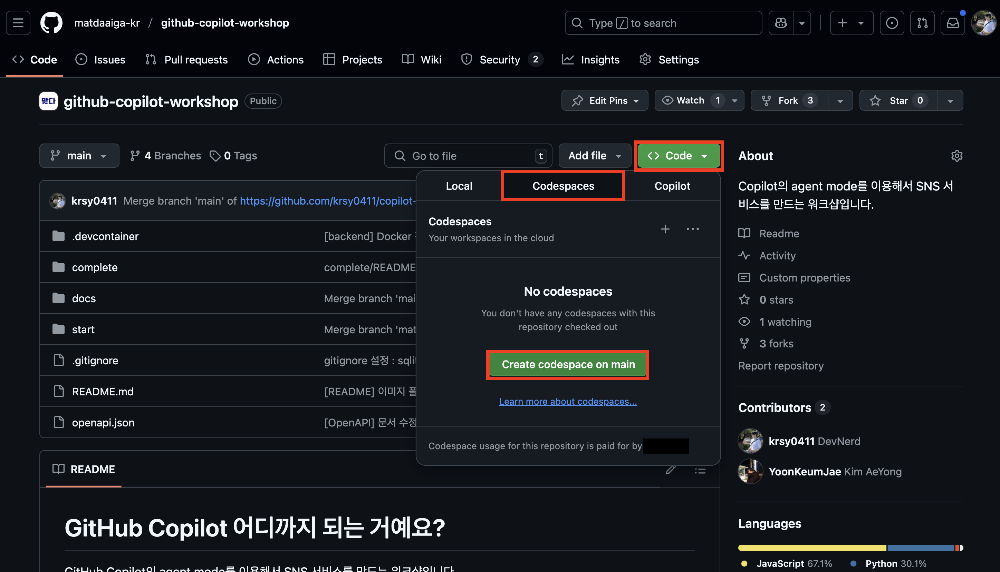

# 개발 환경 설정

## GitHub Codespaces 사용


위 이미지를 따라 차례로 `[<> Code]` 👉 `[Codespaces]` 👉 `[Create codespace on main]`를 클릭해서 GitHub Codespaces 인스턴스를 생성합니다. 네트워크 사정에 따라 대략 5분-10분 정도 걸립니다.

🎉 GitHub Codespaces를 사용하면 개발 환경이 모두 준비되어 있습니다!! 아래 내용은 건너뛰고 곧바로 [STEP 01 : 프롬프트 입력을 위한 기본 설정](./step-01.md) 단계로 넘어가면 됩니다.

> ⚠️ 주의 : Visual Studio Code를 사용한다면, 아래 과정들을 모두 수행해야 합니다. 그러나 GitHub Codespaces 사용을 권장합니다.

## 사전 준비 사항

- [git CLI](https://git-scm.com/downloads) 설치
- [GitHub CLI](https://cli.github.com/) 설치
- [Python](https://www.python.org/) 설치
- [Docker Desktop](https://docs.docker.com/get-started/introduction/get-docker-desktop/) 설치
- [Visual Studio Code](https://code.visualstudio.com/) 설치

## git CLI 설치 확인

1. 터미널에서 아래 명령어를 실행시켜 현재 git CLI를 설치했는지 확인합니다.

   > ⚠️ 주의 : 자신이 사용 중인 터미널 종류에 따라 다음 두 명령어 중 하나를 입력합니다.

   ```bash
   # Bash/Zsh
   which git
   ```

   ```powershell
   # PowerShell
   Get-Command git
   ```

   `git`을 실행시킬 수 있는 경로가 보이지 않는다면 설치하지 않은 것입니다. 만약 설치하지 않았다면 [git CLI 설치 페이지](https://git-scm.com/downloads)에서 최신 버전을 다운로드 받아 설치합니다.

1. 터미널에서 아래 명령어를 실행시켜 현재 설치한 git CLI 버전을 확인합니다.

   ```bash
   git --version
   ```

   `2.48.0` 이상의 버전이 있어야 합니다. 만약 이보다 버전이 낮다면 [git CLI 설치 페이지](https://git-scm.com/downloads)에서 최신 버전을 다운로드 받아 설치합니다.

## GitHub CLI 설치 확인

1. 터미널에서 아래 명령어를 실행시켜 현재 GitHub CLI를 설치했는지 확인합니다.

   > ⚠️ 주의 : 자신이 사용 중인 터미널 종류에 따라 다음 두 명령어 중 하나를 입력합니다.

   ```bash
   # Bash/Zsh
   which gh
   ```

   ```powershell
   # PowerShell
   Get-Command gh
   ```

   `gh`을 실행시킬 수 있는 경로가 보이지 않는다면 설치하지 않은 것입니다. 만약 설치하지 않았다면 [GitHub CLI 설치 페이지](https://cli.github.com/)에서 최신 버전을 다운로드 받아 설치합니다.

2. 터미널에서 아래 명령어를 실행시켜 현재 설치한 GitHub CLI 버전을 확인합니다.

   ```bash
   gh --version
   ```

   `2.70.0` 이상의 버전이 있어야 합니다. 만약 이보다 버전이 낮다면 [GitHub CLI 설치 페이지](https://cli.github.com/)에서 최신 버전을 다운로드 받아 설치합니다.

3. GitHub에 로그인 했는지 확인합니다.

   ```bash
   gh auth status
   ```

   만약 로그인하지 않았다고 나온다면, `gh auth login` 명령어를 통해 로그인합니다.

## Python 설치 확인

1. 터미널에서 아래 명령어를 실행시켜 현재 Python을 설치했는지 확인합니다.

   ```bash
    # Bash/Zsh
    which python
   ```

   ```bash
   # PowerShell
   Get-Command python
   ```

   > 🥕 팁 : `python`을 실행시킬 수 있는 경로가 보이지 않는다면 설치하지 않은 것입니다. 만약 설치하지 않았다면 [python 설치 페이지](https://www.python.org/downloads/)에서 `3.12.*` 버전을 다운로드 받아 설치합니다.
   >
   > ⚠️ 주의 : 특정 패키지가 아직 최신 버전의 python과 호환되지 않는 문제가 있습니다. 최신 버전(`3.13.*`) 말고 `3.12.*` 버전을 사용해주세요. 이미 3.13 버전이 설치되어 있다면, 버전을 낮춰야 합니다.

## Docker Desktop 설치 확인

1. 터미널에서 아래 명령어를 실행시켜 현재 Docker Desktop을 설치했는지 확인합니다.

   ```bash
   # Bash/Zsh
   which docker
   ```

   ```bash
   # PowerShell
   Get-Command docker
   ```

   `docker`을 실행시킬 수 있는 경로가 보이지 않는다면 설치하지 않은 것입니다. 만약 설치하지 않았다면 [Docker Desktop 설치 페이지](https://docs.docker.com/get-started/introduction/get-docker-desktop/)에서 최신 버전을 다운로드 받아 설치합니다.

2. 터미널에서 아래 명령어를 실행시켜 현재 설치한 Docker Desktop 버전을 확인합니다.

   ```bash
   docker --version
   ```

   `27.4.0` 이상의 버전이 있어야 합니다. 만약 이보다 버전이 낮다면 [Docker Desktop 설치 페이지](https://docs.docker.com/get-started/introduction/get-docker-desktop/)에서 최신 버전을 다운로드 받아 설치합니다.

## Visual Studio Code 설치 확인

1. 터미널에서 아래 명령어를 실행시켜 현재 Visual Studio Code를 설치했는지 확인합니다.

   > ⚠️ 주의 : 자신이 사용 중인 터미널 종류에 따라 다음 두 명령어 중 하나를 입력합니다.

   ```bash
   # Bash/Zsh
   which code
   ```

   ```bash
   # PowerShell
   Get-Command code
   ```

   `code`을 실행시킬 수 있는 경로가 보이지 않는다면 설치하지 않은 것입니다. 만약 설치하지 않았다면 [Visual Studio Code 설치 페이지](https://code.visualstudio.com/)에서 최신 버전을 다운로드 받아 설치합니다.

2. 터미널에서 아래 명령어를 실행시켜 현재 설치한 Visual Studio Code 버전을 확인합니다.

   ```bash
   code --version
   ```

   `1.99.0` 이상의 버전이 있어야 합니다. 만약 이보다 버전이 낮다면 [Visual Studio Code 설치 페이지](https://code.visualstudio.com/)에서 최신 버전을 다운로드 받아 설치합니다.

   > 🥕 팁 : 만약 터미널에서 `code` 명령어를 실행시킬 수 없다면, [이 문서](https://code.visualstudio.com/docs/setup/mac#_launching-from-the-command-line)를 참고하여 설정합니다.

## Visual Studio Code 시작

1. 터미널을 열고 작업할 디렉토리로 이동합니다.
2. 작업 디렉토리로 이동했다면, 아래 명령어를 실행시켜 이 리포지토리를 자신의 GitHub 계정으로 포크한 후 자신의 컴퓨터로 클론합니다.
   ```bash
   gh repo fork matdaaiga-kr/copilot-agent-workshop --clone
   ```
3. 터미널에서 아래 명령어를 실행시켜 Visual Studio Code를 실행시킵니다.

   ```bash
   code .
   ```

4. Visual Studio Code에서 터미널을 열고 아래 명령어를 실행시켜 현재 리포지토리의 클론 상태를 확인합니다.

   ```bash
   git remote -v
   ```

   이 명령어를 실행하면 아래와 같은 결과가 나와야 합니다.

   > ⚠️ 주의 : 만약 `origin`에 `matdaaiga-kr`이 보이면 자신의 리포지토리에서 다시 클론해야 합니다.

   ```bash
   origin  https://github.com/<자신의 GitHub ID>/copilot-agent-workshop.git (fetch)
   origin  https://github.com/<자신의 GitHub ID>/copilot-agent-workshop.git (push)
   upstream        https://github.com/matdaaiga-kr/copilot-agent-workshop.git (fetch)
   upstream        https://github.com/matdaaiga-kr/copilot-agent-workshop.git (push)
   ```

5. Visual Studio Code의 터미널에서 아래 명령어를 실행시켜 [GitHub Copilot 익스텐션](https://marketplace.visualstudio.com/items?itemName=GitHub.copilot)과 [GitHub Copilot Chat 익스텐션](https://marketplace.visualstudio.com/items?itemName=GitHub.copilot-chat)을 설치했는지 확인합니다.

   > ⚠️ 주의 : 자신이 사용 중인 터미널 종류에 따라 다음 두 명령어 중 하나를 입력합니다.

   ```bash
   # Bash/Zsh
   code --list-extensions | grep github.copilot
   ```

   ```powershell
   # PowerShell
    code --list-extensions | Select-String "ms-dotnettools.csdevkit"
   ```

   만약 아무 메시지도 보이지 않는다면, 아직 설치하지 않은 것입니다. 아래 두 명령어를 차례로 실행시켜 설치합니다.

   ```bash
   code --install-extension "github.copilot" --force
   ```

   ```bash
   code --install-extension "github.copilot-chat" --force
   ```

---

🎉 수고하셨습니다!! **개발 환경 설정** 부분이 끝났습니다. 이제 [STEP 01 : 프롬프트 입력을 위한 기본 설정](./step-01.md) 단계로 넘어가겠습니다.
