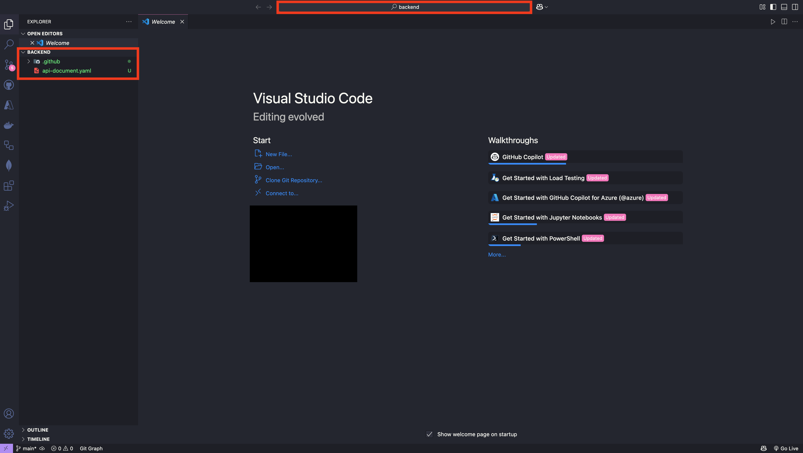

# 프롬프트 입력을 위한 기본 설정

## 사전 준비 사항

이전 [STEP 00 : 개발 환경 설정](./step-00.md)에서 개발 환경을 모두 설정한 상태라고 가정합니다.

## 리포지토리 루트 설정

1. 터미널을 열고 아래 명령어를 실행시켜 `$REPOSITORY_ROOT` 환경 변수를 설정합니다.

   > ⚠️ 주의 : 자신이 사용 중인 터미널 종류에 따라 다음 두 명령어 중 하나를 입력합니다.

   ```bash
   # Bash/Zsh
   REPOSITORY_ROOT=$(git rev-parse --show-toplevel)
   ```

   ```powershell
   # PowerShell
   $REPOSITORY_ROOT = git rev-parse --show-toplevel
   ```

## 시작 프로젝트 복사

미리 `save-points` 폴더에 필요한 파일들을 준비해 뒀습니다. 복사 후 백엔드 프로젝트 구조는 다음과 같습니다.

```text
backend
├── .github
│   └── copilot-instructions.md
├── api-document.yaml
```

1. 아래 명령어를 입력해 실습 디렉토리를 만들고 시작 프로젝트를 복사합니다.

   > ⚠️ 주의 : 자신이 사용 중인 터미널 종류에 따라 다음 두 명령어 중 하나를 입력합니다.

   ```bash
   # Bash/Zsh
   mkdir -p $REPOSITORY_ROOT/backend && \
       cp -a $REPOSITORY_ROOT/save-points/backend/. $REPOSITORY_ROOT/backend/
   ```

   ```powershell
   # PowerShell
   New-Item -Type Directory -Path $REPOSITORY_ROOT/backend -Force && `
       Copy-Item -Path $REPOSITORY_ROOT/save-points/step-01/* -Destination $REPOSITORY_ROOT/backend -Recurse -Force
   ```

2. 백엔드 프로젝트로 이동합니다.
   ```bash
   cd $REPOSITORY_ROOT/backend
   ```
3. 다음 명령어를 이용해 Visual Studio Code 창을 하나 더 열어줍니다.
   ```bash
   code .
   ```
4. 새롭게 열린 Visual Studio Code 화면은 다음과 같이 `backend` 폴더가 루트 디렉토리에 위치해 있습니다.
   

---

수고하셨습니다!! **프롬프트 입력을 위한 기본 설정** 부분이 끝났습니다. 이제 [STEP 02 : 백엔드 API 개발](./step-02.md) 단계로 넘어가겠습니다.
