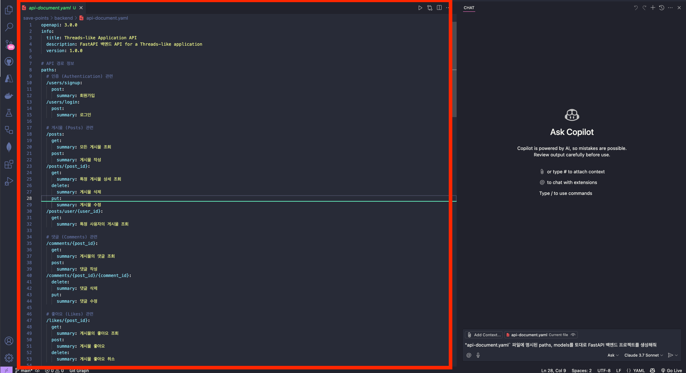
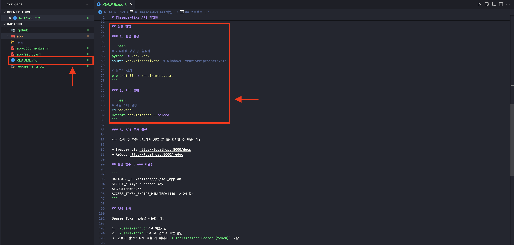

# 백엔드 API 개발

## 사전 준비 사항

이전 [STEP 01 : 프롬프트 입력을 위한 기본 설정](./step-01.md)에서 프롬프트 입력을 위한 파일들을 모두 복사한 상태라고 가정합니다.

## 프로젝트 실행

1. 처음 [STEP 00 : 개발 환경 설정](./step-00.md) 단계에서 익스텐션을 정상적으로 설치했다면, 다음과 같은 아이콘을 확인할 수 있습니다.
   

   아이콘을 클릭해 chat 기능을 활성화하면, 다음과 같은 화면을 볼 수 있습니다.
   

   > 🥕 팁 : 만약 익스텐션을 설치했음에도 보이지 않는다면, `ctrl+alt+i` 키를 누르거나 `ctrl+cmd+i` 키를 눌러 chat을 엽니다.

2. 다음 과정들을 통해 `agent` 모드로 변경합니다.
   
   
3. 다음 과정들을 통해 AI 모델을 `Claude 3.7 Sonnet`으로 변경합니다.
   
   
4. 코파일럿이 현재 파일을 더 빠르게 인식할 수 있도록 `backend/openapi.json` 파일을 클릭해 열어줍니다.
   
5. 이제 다음 내용을 프롬프트에 입력합니다.
   ```text
   “openapi.json" 문서를 이용해서 FastAPI 백엔드 프로젝트를 생성해줘. 단, 너가 임의로 경로나 DB 스키마를 변경하거나 빼먹거나 추가하지 말아줘. 그리고 경로에 버전 접두사를 붙이지 말아줘.
   ```
6. 프로젝트가 하나 만들어졌다면, 프론트엔드 연결을 위해 CORS 에러를 해결해줘야합니다. 다음 문장을 프롬프트에 입력합니다.
   ```text
   "http://localhost:3000", "http://127.0.0.1:3000" 주소에 대해 CORS 에러가 안 나도록 수정해줘
   ```
7. 코파일럿이 `backend` 프로젝트 안에 `README.md` 파일을 생성해서 다음과 같이 프로젝트 실행 방법 순서를 적어뒀습니다. 이를 참고해 프로젝트를 실행합니다.
   

   > 🥕 팁 : `README.md` 파일이 생성되지 않았다면, 프롬프트에 다음 내용을 입력합니다.
   >
   > ```text
   > 프로젝트를 실행하기 위한 과정을 README.md 파일에 작성해줘
   > ```

8. 프로젝트를 실행하셨다면, 이제 프로젝트의 오류를 마주칠 때 해당 오류를 수정해달라는 내용을 프롬프트에 입력합니다.
   ```text
   # 예시
   1. "CORS 에러가 나는데, 수정해줘"
   2. 터미널 오류 메세지를 프롬프트에 복사+붙여넣기한 후, "이거 수정해줘"
   ```
   > 🥕 팁 : 바이브 코딩의 묘미는 "해줘"체를 사용하는 것입니다.

# 번외) 완성된 버전의 백엔드 프로젝트를 실행해보고 싶다면?

1. 원래 Visual Studio Code 창으로 돌아와 아래 명령어를 터미널에 입력합니다.
   ```bash
   cd $REPOSITORY_ROOT/complete/backend
   ```
2. 아래 명령어를 터미널에 입력해 `.env` 파일을 생성합니다.

   > ⚠️ 주의 : 자신이 사용 중인 터미널 종류에 따라 다음 두 명령어 중 하나를 입력합니다.

   ```bash
   # Bash/Zsh
   touch .env
   ```

   ```powershell
   # PowerShell
   New-Item -Path .env -ItemType File
   ```

3. `.env` 파일을 열고 다음 내용을 입력합니다.

   ```text
   SECRET_KEY=09d25e094faa6ca2556c818166b7a9563b93f7099f6f0f4caa6cf63b88e8d3e7
   ALGORITHM=HS256
   ACCESS_TOKEN_EXPIRE_MINUTES=1440
   DATABASE_URL=sqlite:///./threads_app.db
   ```

4. [complete/backend/README.md](/complete/backend/README.md) 파일의 `실행 방법` 섹션에 따라 명령어를 입력해 프로젝트를 실행합니다.
