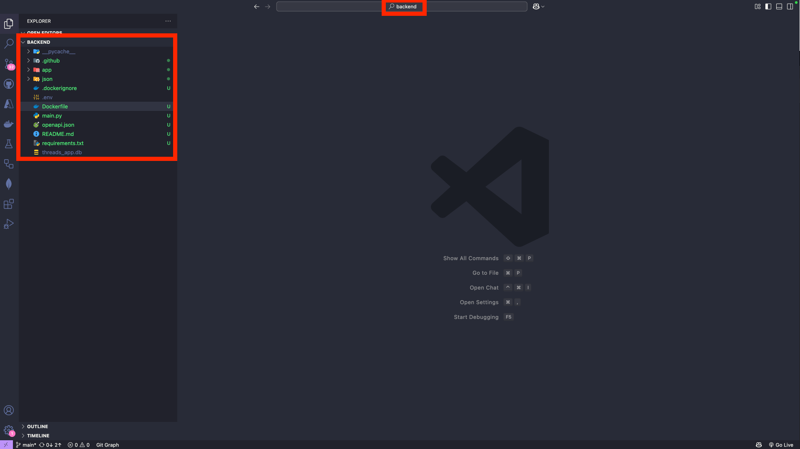
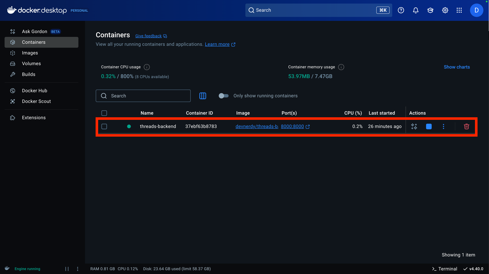
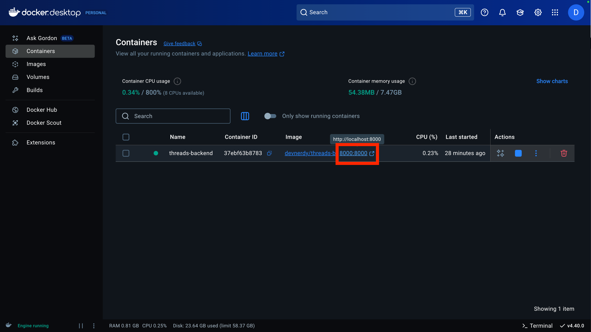

# 도커로 어디서나 실행 가능한 워크샵 환경 만들기

## 사전 준비 사항

이전 [STEP 02 : 백엔드 API 개발](./step-02.md)에서 백엔드 API 개발용 소스코드 파일들을 모두 생성한 상태라고 가정합니다.

> 🥕 팁 : 만약 오류를 해결하지 못했다면, `complete/backend` 폴더를 복사해서 사용합니다.

## 도커 컨테이너 실행

1. 자신의 현재 `Visual Studio Code` 작업 디렉토리의 위치가 `backend`가 맞는 지 확인합니다.
   
2. 터미널을 열고, 아래 명령어를 터미널에 입력해 도커 데스크탑을 실행하고 있는 지 다시 확인합니다.

   ```text
   docker info
   ```

   > ⚠️ 주의 : 시스템 정보가 출력되지 않고 에러 메세지가 나온다면, 도커 데스크탑을 설치하고 실행해주세요.

3. 아래 명령어를 터미널에 입력해 `backend` 프로젝트를 컨테이너로 실행합니다.
   ```text
   docker run -d -p 8000:8000 -v $(pwd)/threads_app.db:/app/threads_app.db --name threads-backend devnerdy/threads-backend:latest
   ```
4. 도커 데스크탑을 열고 아래와 같이 컨테이너가 실행되고 있음을 확인합니다.
   
5. 다음과 같이 `port` 섹션 아래 링크를 클릭해 브라우저를 엽니다.
   
6. `localhost:8000/docs` 경로로 이동합니다.
   

---

축하합니다!! `도커로 어디서나 실행 가능한 워크샵 환경 만들기`이 끝났습니다!! 바이브 코딩을 이용한 여러분만의 애플리케이션 개발에 도전해보세요!!
