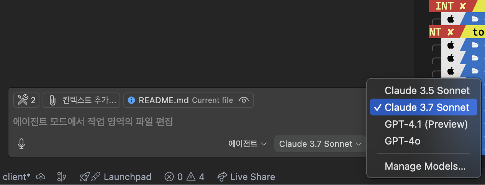
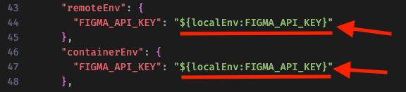
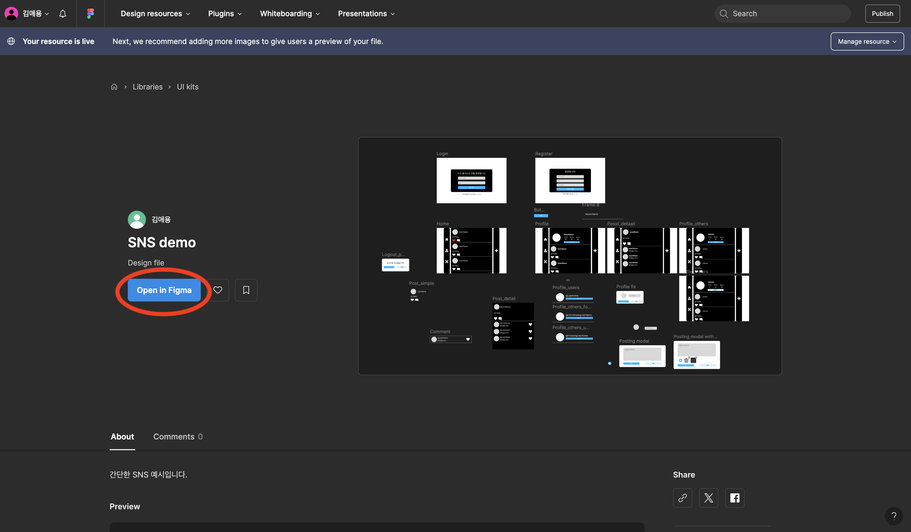

# 프롬프트 입력을 위한 기본 설정

## 사전 준비 사항

이전 [STEP 00 : 개발 환경 설정](./step-00.md)에서 개발 환경을 모두 설정한 상태라고 가정합니다.

만약 GitHub Codespace를 사용한다면 이전 단계를 생략하고 [Figma 디자인 구현](#figma-디자인-구현)으로 넘어갑니다.

## GitHub Copilot 설정

1. 설정에서 `Agent`를 검색하고 아래와 같이 적용합니다.
   

1. 화면 좌측의 `채팅` 아이콘을 눌러 Copilot 대화창을 엽니다. <br/>
   

1. 대화창 하단의 드롭다운 버튼을 눌러 `에이전트 모드`로 바꿉니다.
   

1. 대화창 하단의 드롭다운 버튼을 눌러 AI 모델을 `Claude 3.7 Sonnet`으로 바꿉니다.
   

## Visual Studio Code, GitHub Copilot의 MCP 사용 설정

1. 에이전트 모드를 사용할 준비가 되었습니다. 이제 에이전트가 MCP를 사용 설정 하겠습니다. 설정에서 `MCP`를 검색하여 사용을 활성화 해 줍니다.
   

1. Figma MCP를 설정해보겠습니다. 대화창 하단의 `도구 선택` 버튼을 누릅니다.
   

1. `MCP 서버 추가` - `NPM 패키지`를 선택합니다.  
   

1. `figma-developer-mcp`를 입력합니다.
   

1. `허용` - `엔터키` - `사용자 설정`을 누릅니다.
   

1. `settings.json` 파일이 열립니다. `YOUR_FIGMA_API_KEY` 부분에 Figma API Key를 넣어야 합니다. [Figma 웹 페이지](https://www.figma.com)의 설정 - Security 창에서 API Key를 생성 후 붙여넣습니다. <br/>
   

1. `도구 선택` 버튼에 두 개의 도구가 추가된 것을 확인합니다. <br/>
   

이제 개발환경 설정이 완료되었습니다!

## Figma 디자인 구현

[Figma](https://www.figma.com)로 미리 디자인 후, Figma MCP를 사용하면 Copilot이 구체적인 디자인을 구현할 수 있습니다. 이번 세션에서 사용된 Figma 파일은 [여기](https://www.figma.com/community/file/1493853152731177725)에서 확인할 수 있습니다.

1. 만약 GitHub Codespace를 사용한다면, [Figma 웹 페이지](https://www.figma.com)의 설정 - Security 창에서 API Key를 생성 후 `.devcontainer/devcontainer.json`에 아래 이미지를 참고하여 붙여넣습니다. <br/>
   

1. 아래 버튼을 눌러 workspace로 프로젝트를 불러옵니다.
   

1. 구현하고 싶은 프레임을 선택하여 `오른쪽 클릭` - `Copy/Paste as` - `Copy link to selection`을 눌러 복사합니다.
   

1. 복사한 링크는 아래와 같이 프롬프트에서 사용됩니다.
   ```markdown
   리액트로 [홈 화면]({YOUR_FIGMA_LINK})을 구현해줘.
   ```

> 위와 같이 `[텍스트](링크)` 형태로 프롬프트를 작성하는 것은 마크다운의 링크 삽입 문법입니다. 대괄호 내부의 텍스트를 클릭하면 소괄호의 링크로 연결됩니다. 프롬프트를 입력할 때 마크다운 형식으로 프롬프트를 작성한다면 더 좋은 결과를 얻을 수 있습니다.

## 리포지토리 루트 설정

1. Visual Studio Code 터미널을 열고 아래 명령어를 실행시켜 `$REPOSITORY_ROOT` 환경 변수를 설정합니다.

   > ⚠️ 주의 : 자신이 사용 중인 터미널 종류에 따라 다음 두 명령어 중 하나를 입력합니다.

   ```bash
   # Bash/Zsh
   REPOSITORY_ROOT=$(git rev-parse --show-toplevel)
   ```

   ```powershell
   # PowerShell
   $REPOSITORY_ROOT = git rev-parse --show-toplevel
   ```

## Copilot 지침 설정
2. Visual Studio Code 터미널에 아래 명령어를 입력해 커스텀 코파일럿 지침 내용을 만듭니다.

   > ⚠️ 주의 : 자신이 사용 중인 터미널 종류에 따라 다음 두 명령어 중 하나를 입력합니다.
   ```bash
   # Bash/Zsh
   cp -r $REPOSITORY_ROOT/start/frontend/.github/. $REPOSITORY_ROOT/.github/
   ```

   ```powershell
   # PowerShell
   Copy-Item -Path $REPOSITORY_ROOT/start/frontend/* -Destination $REPOSITORY_ROOT/ -Recurse -Force
   ```

## 프롬프트 입력하고 프로젝트 시작하기

1. 아래와 같이 프롬프트를 입력합니다.

   ```text
   리액트 개발을 시작하기 위한 세팅을 해줘. 프로젝트 이름은 {YOUR_PROJECT_NAME}이야.
   ```

1. 이제 Figma의 디자인을 복사해 아래와 같이 입력하여 애플리케이션을 완성합니다.
   ```text
   `openapi.json` 파일의 API 문서를 바탕으로 [{기능명}]({Figma 링크}) 기능을 구현해줘.
   ```

> 앱 전체를 프롬프트로 입력하는 것 보다, 기능별로(홈 화면, 검색 화면 등) 명령하는 것이 더 고품질의 결과물을 얻을 수 있습니다.

# 번외) 완성된 버전의 프론트엔드 프로젝트를 실행해보고 싶다면?

1. 아래 명령어를 터미널에 입력합니다.
   ```bash
   cd $REPOSITORY_ROOT/complete/frontend && npm install
   ```
1. 아래 명령어를 터미널에 입력하여 서버를 실행합니다.

   ```bash
   npm start
   ```
