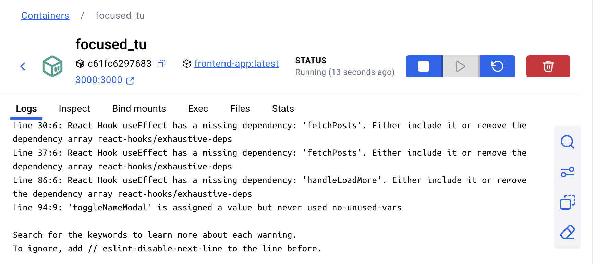
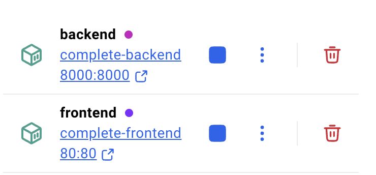
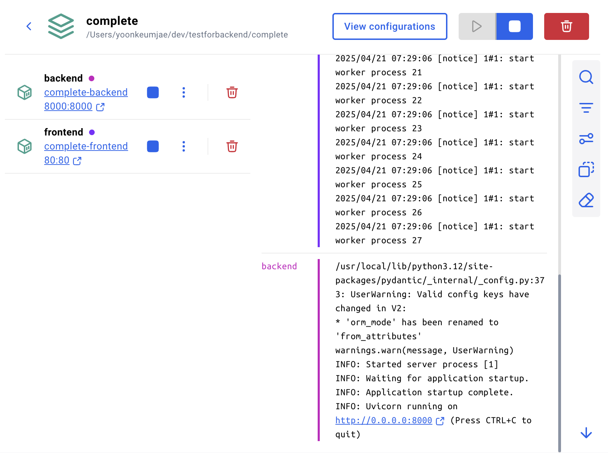
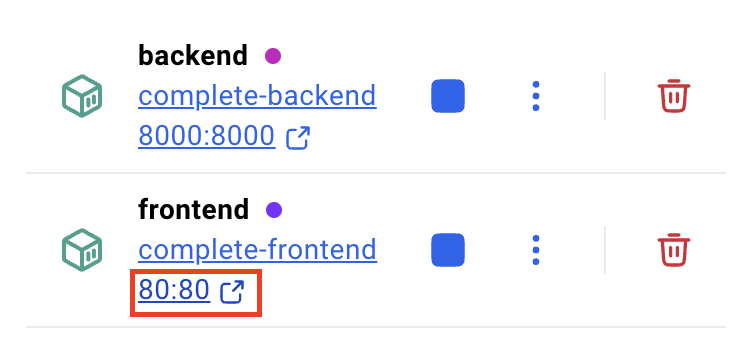

# 도커로 어디서나 실행 가능한 워크샵 환경 만들기

## 사전 준비 사항

이전 [STEP 01 : 프롬프트 입력을 위한 기본 설정](./step-01.md)에서 프론트엔드 앱 개발용 소스코드 파일들을 모두 생성한 상태라고 가정합니다. 만약 STEP 1에서 완성한 프로그램을 실행 중이라면 종료해주세요.

> 🥕 팁 : 만약 오류를 해결하지 못했다면, `complete/frontend` 폴더를 복사해서 사용합니다.

## 루트 디렉토리 설정

1. Visual Studio Code에서 **새 터미널**을 열고, 아래 명령어를 입력해 `$REPOSITORY_ROOT` 환경 변수를 설정합니다.

   > ⚠️ 주의 : 자신이 사용 중인 터미널 종류에 따라 다음 두 명령어 중 하나를 입력합니다.

   ```bash
   # Bash/Zsh
   REPOSITORY_ROOT=$(git rev-parse --show-toplevel)
   ```

   ```powershell
   # PowerShell
   $REPOSITORY_ROOT = git rev-parse --show-toplevel
   ```

1. 이어서 `$REPOSITORY_ROOT/{YOUR_PROJECT_NAME}`로 이동합니다. 
   ```bash
   cd $REPOSITORY_ROOT/{YOUR_PROJECT_NAME}
   ```
   > 여기서 프로젝트 명은 프론트엔드 앱을 생성할 때 만든 폴더의 이름입니다. 

## 도커 파일 생성

1. Copilot 대화창에 다음 프롬프트를 입력합니다. 
   ```text
   프론트엔드 앱을 배포하기 위한 dockerfile을 만들어줘. 포트는 3000번 포트 그대로 사용하고싶어. 
   ```

1. Dockerfile이 생성되었으면 에이전트의 설명에 따라 Dockerfile을 실행시킵니다. 
   > Docker Desktop이 실행중인지 확인해주세요! 실행중이 아니라면 작동하지 않습니다. 

1. Docker Desktop을 켜서 컨테이너가 실행중인 것을 확인합니다. 
   


1. `http://localhost:3000`으로 접속하여 앱을 실행시킵니다.

## 백엔드 서버와 통신하기

여기서부터는 이전 [STEP 03 : 어디서나 실행 가능한 워크샵 환경 만들기](../backend/step-03.md)에서 백엔드 앱 개발용 소스코드 파일들을 모두 생성한 상태라고 가정합니다. 만약 [STEP 02: 백엔드 API 개발](../backend/step-02.md)에서 완성한 프로그램을 실행 중이라면 종료해주세요.

> 🥕 팁 : 만약 오류를 해결하지 못했다면, `complete/backend` 폴더를 복사해서 사용합니다.

1. 실행중인 컨테이너들을 모두 종료합니다. <br/>
   

1. Copilot의 대화창에 아래 명령어를 입력합니다. 
   ```text
    frontend/Dockerfile, backend/Dockerfile을 참조해서 프론트엔드와 백엔드 컨테이너가 서로 통신할 수 있게 compose 파일을 만들어줘. 
   ```
1. 에이전트의 명령에 따라 compose 파일을 실행시키고, Docker Desktop에서 실행중인 것을 확인합니다. 
   

1. 프론트엔드 앱에 접속해 백엔드 API와 통신이 잘 되는 것을 확인합니다. 
   

---

축하합니다!! `도커로 어디서나 실행 가능한 워크샵 환경 만들기`이 끝났습니다!! 바이브 코딩을 이용한 여러분만의 애플리케이션 개발에 도전해보세요!!
